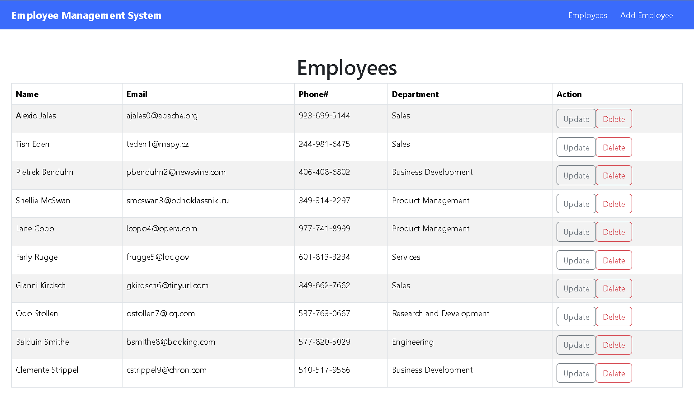

# Employee Management System (EMS) Frontend

This project is the frontend for an Employee Management System built using Java and Spring Boot. It provides a user-friendly interface to manage employee data through CRUD operations via a RESTful API.



## Features

- View all employees
- Edit employee details
- Delete employees
- Interacts with backend RESTful API

## Technologies Used

- Java 17
- Spring Boot 3
- React

## Getting Started

1. **Clone the repository:**

   ```bash
   git clone https://github.com/andymartinez1/Employee-Management-System-2.git
   ```

### Backend

The backend for this project is built with Java 17 and Spring Boot 3. It exposes RESTful endpoints for managing employee data and handles all business logic and data persistence.

- **Repository:** [EMS-Backend](https://github.com/andymartinez1/EMS-Backend)
- **Technologies:** Java 17, Spring Boot 3, JPA, H2/MySQL
- **How to Run:**
  1.  Install dependencies and build the project.
  2.  Configure applications.properties depending on your database
  3.  Start the backend server (`./mvnw spring-boot:run`).
- **Default API Base URL:** `http://localhost:8080`

Make sure the backend is running before using the frontend to ensure proper communication between both applications.

2. **Install dependencies:**

   ```bash
   npm install
   ```

3. **Run the application:**

   ```bash
   npm start
   ```

## API Endpoints

- `GET /employees` - List all employees
- `POST /employee` - Add a new employee
- `PUT /employee/{id}` - Update employee details
- `DELETE /employee/{id}` - Remove an employee
